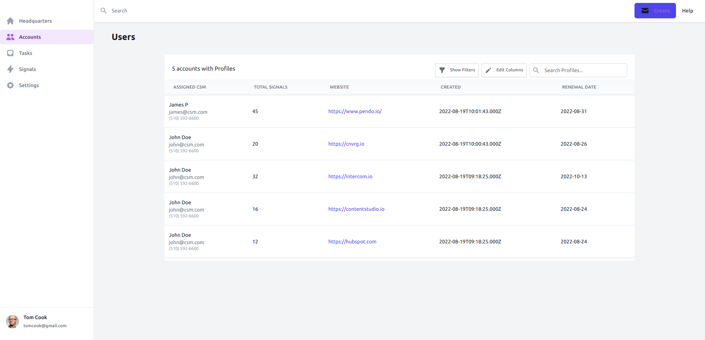

<!-- @format -->


# Stealth-Coding-Challenge

> A reusable component that gets the required data from an airtable database, displays the data in a data table and filters the data based on multi-query search.

## Desktop Preview



## Deployment

You can find the app [live link here](https://stealthChallenge.netlify.app/)

## Back-end Repository
You can find the back-end API [in this Repo](https://github.com/zhadier/fastApi-backend). The back-end was made using python and fast-API integrated with the AIrtable API for the database.

## Built With

- Languages: _**JavaScript, HTML & SCSS**_
- Frameworks: _**React**_
- Technologies used: _**Visual Studio Code**_

## Getting Started

### To launch the project locally:

#### Step 1:

- Clone this repo locally using git in the command line and the following command

```bash
> git clone git@github.com:zhadier/Stealth-Coding-Challenge.git
> cd Stealth-Coding-Challenge
```
- Alternatively, you can just download the complete zip file and extract the folder in your directory

#### Step 2:
- Download all dependencies to use the Project

```bash
> npm install
```

#### Step 3:

In the project directory, you can run:

##### `npm start`

Runs the app in the development mode.\

The page will reload when you make changes.\
You may also see any lint errors in the console.

##### `npm run build`

Builds the app for production to the `build` folder.\
It correctly bundles React in production mode and optimizes
the build for the best performance.

The build is minified and the filenames include the
hashes.\
Your app is ready to be deployed!

See the section about
[deployment](https://facebook.github.io/create-react-app/docs/deployment)
for more information.

## Original Authors

 👤 **Zeeshan Haider**

  Platform | Badge |
 --- | --- |
 **GitHub**   | [@zhadier](https://github.com/zhadier)
 **LinkedIn** | [Zeeshan Haider](https://www.linkedin.com/in/zhadier39/)


## 🤝 Contributing

Contributions, issues, and feature requests are welcome and highly encouraged!
We feel that your input is what helps us grow so you're always Welcome :)

Feel free to check the [issues page](../../issues/).

## Show your support

Give a ⭐️ if you like this project!
I would love to hear your thoughts and ideas 🖤


## 📝 License

This project is [MIT](./LICENSE) licensed.
